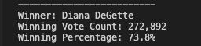

my_votes = int(input("How many votes did you get in the election? "))
total_votes = int(input("What is the total votes in the election? "))
percentage_votes = (my_votes / total_votes) * 100
print("I received " + str(percentage_votes)+"% of the total votes.")
# Election_Analysis

## Project Overview
Through this report I am going to present you an analysis for an election audit in the Colorado Board of Elctions. In order to find the winner of the race, I have ran a sequence of code which have provided with the results.In order to come to such results I needed to come up with the information below.

1.Calculate the total number of votes cast.
2.All candidates in the election.
3.The sum of all votes received per candidate.
4.The sum of number of votes per county.
5.Percentage of votes each candidate won.
6.Determine the winner of the election.

## Resources
-Data Source:Election_results.csv
-Software: Python 3.8.6, VS Code 1.71.2

##Summary
Through the the analysis I was able to determine that:
A total of 369,711 votes were cast during this congressional election. 

##Denver which had the largers number of voters, 306,055 or 82.8%, was the most pupular state to win the election,as you can see in the images below. The county with the least number of tourn outs was Arapahoe which only had a 6.7% of of voters show up, (24,801).
-The Candidates were:
Diana DeGette who won the election by a landslide of 73.8% of the vote which is (272,892 votes).

##Charles Casper Stockham was behind Diana, but not close enought as he only won 23.0% (85,213 votes).
Raymon Anthony Doane seem to not have been a populat runner as he received 3.1% (11,606 votes).

##Challenge Overview
In a world where election fraud has become a hot topic. I believe that having responsible method to analyze election results is crucial. 
the code presented below does just that. I belive this code can be ajuested to ran any election going foward in the country or other countries alike. Through a more or less refactoring of this code we can move foward with honest and fair elections. 

